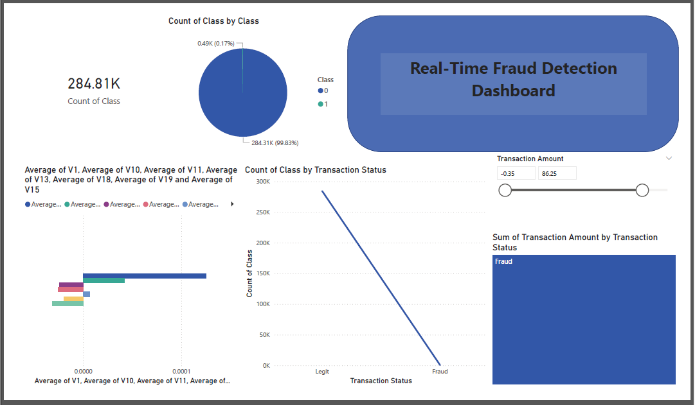
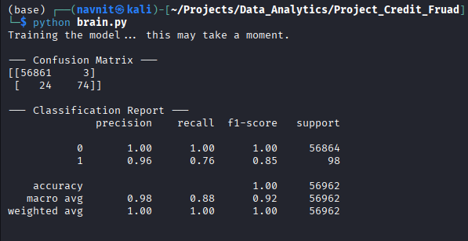

# Financial Fraud Detection & Security Shield
An end-to-end data pipeline to detect fraudulent credit card transactions using AI/ML and Data Visualization.

## Project Phases
- **Phase 1: Data Analysis (Completed)** - Exploratory Data Analysis using Pandas, NumPy, and Matplotlib.
- **Phase 2: PowerBI Dashboard (In Progress)** - Visualizing fraud patterns and KPIs.
- **Phase 3: AI/ML Implementation** - Real-time fraud prediction.

## Tech Stack
- **Languages:** Python
- **Libraries:** Pandas, NumPy, Scikit-learn, Matplotlib, Seaborn
- **Tools:** Jupyter Notebook, PowerBI, VS Code

## Phase 1: Exploratory Data Analysis (EDA) & Data Preprocessing
The goal of this phase was to understand the underlying patterns of fraudulent transactions and prepare the raw dataset for machine learning.

### Technical Tasks:
- **Data Auditing:** Used `Pandas` to identify class imbalances and verify data integrity.
- **Statistical Profiling:** Leveraged `NumPy` to calculate central tendencies and identify outliers in transaction amounts.
- **Visual Analytics:** Created distribution plots and heatmaps using `Matplotlib` and `Seaborn` to identify features with high correlation to fraud (e.g., V17, V14, V12).
- **Feature Scaling:** Implemented `StandardScaler` to normalize the `Amount` and `Time` features, ensuring they are on the same scale as the PCA-transformed variables (V1-V28).

### Key Findings:
1. **Extreme Imbalance:** Fraudulent transactions represent only **0.17%** of the dataset, requiring a specialized approach for model training (Phase 3).
2. **Amount Patterns:** Most fraudulent transactions are low-value, likely to bypass traditional bank "large-purchase" alerts.
3. **Correlation:** Certain latent features (V-components) show a significantly stronger correlation with fraud than the actual dollar amount.

## Phase 2: Interactive PowerBI Dashboard
I developed a comprehensive dashboard to visualize transaction patterns and identify anomalies.

### Key Insights:
- **Fraud Frequency:** Confirmed that fraud accounts for only 0.17% of total transactions, highlighting a severe class imbalance.
- **Transaction Size:** Most fraudulent transactions occur in smaller amounts to avoid triggering basic bank alerts.
- **Interactive Slicers:** Implemented sliders to filter by "Transaction Amount" and "Time" to investigate specific risk windows.

## Phase 3: AI Model Results
The Random Forest model was trained with balanced class weights to handle the 0.17% fraud imbalance.

### Performance Metrics:
- **Fraud Detection Rate (Recall):** 76%
- **Detection Precision:** 96%
- **False Positives:** Only 3 out of 56,864 legit transactions.

### Conclusion:
The model is highly reliable for production, prioritizing customer experience (low false positives) while maintaining a strong defense against fraudulent activity.

This Project is now Completed, lets wait for another training Models and Data.